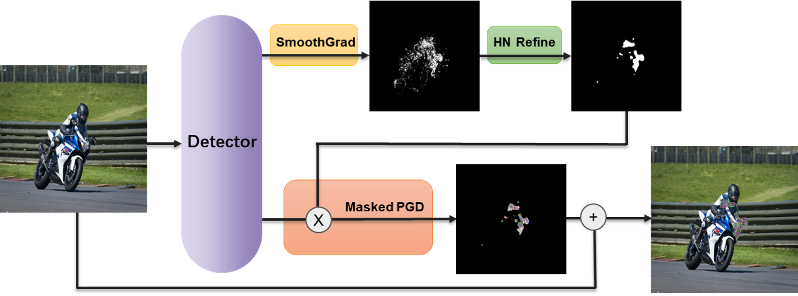

# HNM-PGD
Code for paper 'Adversarial Attacks Using Half-Neighbor Masks for Object Detection'

We propose a Half-Neighbor Masked Projected Gradient Descent (HNM-PGD) attack that can fool object detection systems under the following constraints:

1. The maximum limit of changed pixel rate in total pixel of the original image is up to $2\%$, i.e., for MS COCO dataset, the maximum number of changed pixels is 5000;
2. The number of 8-connectivity regions is not greater than 10.

We also applied the proposed HNM-PGD attack in the [CIKM 2020 AnalytiCup Competition](https://www.cikm2020.org/adversarial-challenge-on-object-detection/), which was ranked within the top 1\% on the leaderboard (17/1701).

HNM-PGD’s workflow can be shown as:

<p align="center">
    
</p>

Where we first compute a given input example's salience map, and conduct a Half-Neighbor (HN) procedure to produce a mask that meet the above constraints. The HN procedure here is inspired by K-Nearest-Neighbor algorithm. To be specific, if half of a pixel's neighbors have been chosen by the current mask, then this pixel would also be chosen, otherwise it will be discarded. Final, we employ a PGD adversary to generate adversarial patch via working with a mask.

For more details, you are welcome to check our paper and run our code as:

```shell
python file_name.py
```

The experimental requirement and dataset can be found [here](https://tianchi.aliyun.com/competition/entrance/531806/information).


